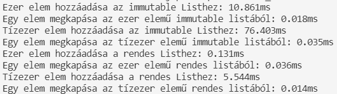

Nem-funkcionális tesztek során főleg a teljesítmény tesztekre koncentráltunk. Az immutable.js arra ad lehetőséget, hogy List, Map illetve 
Set adattömböket hozzunk létre, úgyhogy azokat később ne lehessen módosítani. Azt vizsgáltuk, hogy a különböző kollekciókon mennyi többlet 
időt vesz igénybe az, hogy ilyen nem-változtatható formában hozzuk őket létre, a normál változtathatóhoz képest. 

## List

A skálázhatóság teszteléséhez, minden tömbön két különböző nagyságú adathalmazt vizsgáltuk meg.
Két alapvető dolgot teszteltünk, amit egy listával lehet csinálni, azaz: tagok hozzáadása, elem elérése. A teszt első része egy Immutable 
List-hez add ezer elemet (10,861ms), majd próbál elérni egy elemet (0,018ms). Majd ezeket futtattuk egy normál List-en is (0,131ms; 0,14ms)
Ezeket  után ezeket a teszteket megismételtük tízezres nagyságban is.
A pontos eredmények az alábbi képen láthatók.

## Map

Itt is figyelembe vettük a skálázhatóságot, ezért két eltérő mennyiségű Map-et is vizsgáltunk. Először ezer, majd tízezer elemet adtunk az 
Immutable és normál Map-ekhez. Majd azt teszteltük, hogy a tízezer elem közül milyen gyorsan lehet egy elemet elérni és egy másikat törölni.
A pontos eredmények az alábbi képen láthatók.

## Set

Olyan teszteket írtunk, amely nem elem számban különbözik, hanem az hozzáadott adatokban. Azaz megnéztük, hogy mi történik akkor, hogy ha 
ezer ugyanolyan, illetve ezer különböző adatot rakunk az Immutable és normál Set-be. Majd megvizsgáltuk, hogy az ezer különböző elem közül
milyen gyors egy elem elérése, illetve törlése a Set-eken.
A pontos eredmények az alábbi képen láthatók.

## Összefoglalás

A tesztek eredményeit megtekintve észrevehetjük, hogy jelentős többlet idővel jár az, hogy ha Immutable kollekcióba szervezzük adatainkat,
attól függetlenül, hogy az éppen List, Map vagy Set. A List és Set halmazoknál látható, hogy minél több elemmel dolgozunk szignifikánsan 
megugrik a művelet ideje, emiatt mondhatjuk, hogy amennyiben nagy adathalmazokkal dolgozunk (több tízezres nagyságrend), akkor jobban járunk,
hogy ha kétszer meggondoljuk, hogy szükséges-e a használata.
Ellenben kis adat mennyiségnél az, hogy biztosak vagyunk, hogy már nem lehet változtatni az adatokon megéri a többlet időt.
